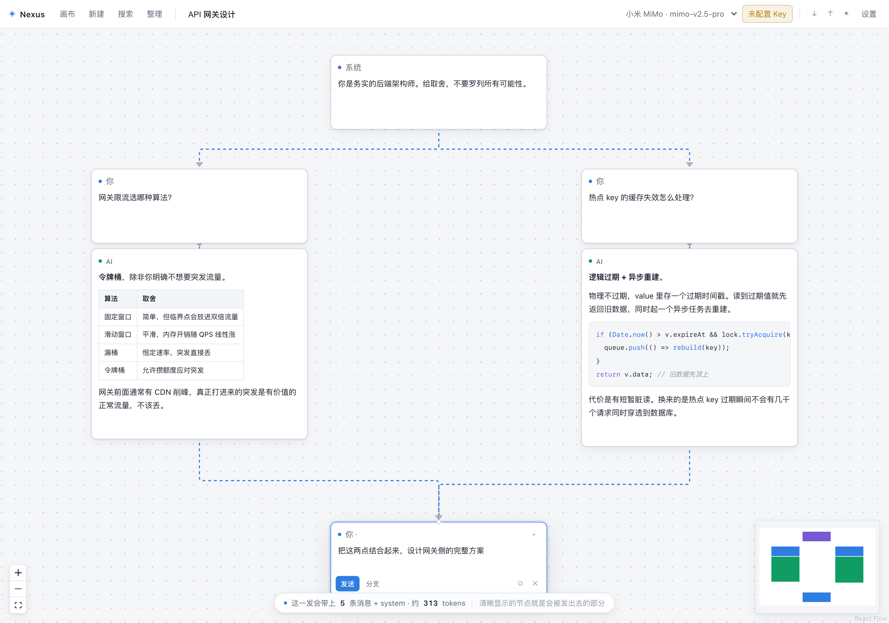

<div align="center">

# Nexus · Non-linear Conversation Canvas

**Turns an AI conversation from a single timeline into a directed acyclic graph**

[中文](README.md) · English

[**Live demo**](https://yule1048596-art.github.io/nonlinear-chat/) · Frontend only · Bring your own API key · Everything stays in your browser

<picture>
  <source media="(prefers-color-scheme: dark)" srcset="docs/canvas-dark.png">
  
</picture>

<sub>Two independent branches (rate-limiting algorithms / cache invalidation) converging into one follow-up node. The status bar shows this request will carry 5 messages plus a system prompt, roughly 313 tokens.</sub>

</div>

---

## What it is

A chat interface where the conversation isn't stacked top-to-bottom in a single column. Instead, messages live as nodes on a canvas you can pan and rearrange, connected by edges — and **a node can have more than one parent**.

When you send, the app collects every ancestor of the current node, topologically sorts them into a single message chain, and hands that to the model. The canvas is a graph; what goes over the wire is still a plain `messages` array, so any OpenAI-compatible endpoint works as-is.

## Why

Mainstream AI chat apps are linear, which causes four problems you can't design around:

| Problem | In a linear chat | Here |
| --- | --- | --- |
| **Context pollution**<br>One tangent derails the main thread | Start a new chat, lose all prior context | Pull a branch off any node; the tangent and the main thread never touch |
| **Losing good answers**<br>Regenerating overwrites the previous one | Gone | "Side-by-side regenerate" keeps the old answer and grows the new one next to it |
| **No comparison**<br>You want to weigh two approaches | Two windows, constant switching | Both branches sit side by side on the canvas |
| **No convergence**<br>Branch A and branch B each hold half the answer | Copy-paste by hand | A node can have **multiple parents**; both branches merge into one context automatically |

**That last row is the whole point.** The first three can be solved with a branching *tree*. Convergence cannot — in a tree every node has exactly one parent, so two branches can never meet again. You need a DAG.

The screenshot above is exactly this: rate-limiting on the left, cache invalidation on the right, each explored without interference, then two edges dragged into one follow-up node. The model now sees all five messages without you pasting any of the earlier answers back in.

## How it works

The canvas is a **graph**; the model needs a **sequence**. That translation lives in [`src/lib/context.ts`](src/lib/context.ts):

1. Walk up from the current node collecting **all ancestors** — reaching the same ancestor through several paths counts once
2. Topologically sort that subgraph (Kahn's algorithm) so a parent always precedes its children
3. Among simultaneously-ready nodes, prefer the earlier `createdAt` — so merged branches interleave in the order things actually happened, while causal order *within* each branch stays intact
4. `system` nodes are pulled out and merged into one system message; `note` nodes are skipped by default, as are empty and errored nodes

Step 4 has a pleasant side effect: **first generation and regeneration share one code path.** Clearing a node's content before regenerating automatically excludes it from its own context — no second implementation needed.

### Context is always visible

The thing that gets out of hand fastest in a non-linear conversation is "what am I actually sending?" So that is the **only strong visual signal** in the interface:

Select any node and everything outside its context fades and desaturates, the edges along the path turn into flowing accent-coloured lines, and the status bar reports the message count and an estimated token count.

Everything else gets out of the way. Per-node action buttons are hidden until you hover or select; so are the model name and token usage. Thirty nodes on a canvas still don't turn into a wall of buttons.

## Features

**Conversation**
- Branch from any node; branches are fully isolated from each other
- Multi-parent merging — the entire reason this is a DAG and not a tree
- Side-by-side regenerate keeps the old answer; re-sending a question that already has an answer also never overwrites it
- Streaming output, stoppable at any time (whatever arrived is kept)
- Reasoning traces (`reasoning_content`) from reasoning models are shown collapsed and excluded from the next turn's context

**Node types**
- **User** — what you say
- **AI** — the model's reply
- **System** — injected as a system prompt into every downstream branch
- **Note** — a canvas annotation, excluded from context unless you opt it in

**Canvas**
- ⌘K full-text search; Enter jumps to the node and centres it
- One-click layered auto-layout (dagre), undoable
- Collapse an entire downstream subtree; the node shows how many are hidden
- Minimap, zoom, box selection

**Safety net**
- Full undo/redo (⌘Z / ⌘⇧Z) covering deletion, linking, layout, regeneration and edits
- Consecutive typing and a single drag coalesce into one history entry — undo doesn't step back one character at a time
- Deleting a subtree tells you how many nodes went and that you can undo
- Cycles are rejected with an explanation

**Seeing the context**
- Click the status bar to preview the exact `messages` that will be sent; every entry traces back to its node
- A separate list shows nodes on the path that were *not* sent, with the reason
- Any node can be muted: it stays on the canvas but leaves the downstream context
- Export a path as a readable Markdown transcript

**Shared knowledge base (RAG)**
- Drop files onto a canvas; **every conversation on that canvas** shares them
- Supports `.txt` `.md` `.docx` `.epub` and common plain text (`.json`, `.csv`, `.html`, source files…)
- Each question semantically retrieves the most relevant passages and prepends them as labelled reference material
- Which passages matched, which file they came from and at what similarity — all listed in the context preview
- Files can be disabled individually instead of deleted and re-added
- If the vector service is unreachable the request is **not sent at all** and says why, rather than quietly answering without the material

**Not losing work**
- Automatic local snapshots, always taken before deleting / importing / rolling back; restore everything or just one canvas
- Settings and full-backup export; exports omit API keys by default
- Importing settings merges profiles and never overwrites your own

**Also**
- Light/dark themes, following the system by default
- Multiple model profiles — run different models on different branches; several answers to the same question can be compared side by side
- Export/import a canvas as JSON

## Quick start

```bash
npm install
```

```bash
npm run dev
```

Open http://localhost:5173 → **设置** (Settings, top right) → pick a provider preset → paste your API key → **测试连接** (Test connection).

Or just use the [hosted version](https://yule1048596-art.github.io/nonlinear-chat/) — nothing to install.

> **Note on UI language:** the interface is currently Chinese-only. Internationalising it is not done yet; this document is the English entry point for now.

## Supported models

Anything that implements the OpenAI `/chat/completions` protocol. Built-in presets fill in the base URL for you:

Xiaomi MiMo · xAI Grok · OpenAI · DeepSeek · OpenRouter · SiliconFlow · Moonshot · Zhipu GLM · local Ollama

Any other base URL can be typed in manually. You can store **several profiles** and use different models on different branches.

> **A chat subscription is not API access.** SuperGrok, ChatGPT Plus and Claude Pro only cover the vendors' own
> web and mobile apps — they include no API quota and cannot be used here. To reach Grok you need a separate
> API key from [console.x.ai](https://console.x.ai), billed per token.

### CORS

The browser talks to the provider directly, so the provider must allow cross-origin requests. All of the above do. Local Ollama needs an environment variable:

```bash
OLLAMA_ORIGINS=* ollama serve
```

When a connection fails, "Test connection" tells you whether it was CORS, a bad key, or a wrong base URL — not just `Failed to fetch`.

## Setting up the knowledge base

The knowledge base needs a **vector service** to turn text into embeddings for semantic search. That is
separate from the chat model and configured on its own. Anything speaking OpenAI's `/v1/embeddings`
works (OpenAI, SiliconFlow, Ollama…).

Running it locally keeps your material on your machine. With llama.cpp and [bge-m3](https://huggingface.co/BAAI/bge-m3):

```bash
llama-server -m bge-m3.gguf --embedding --embd-normalize 2 --pooling cls \
  --port 8081 --alias text-embedding-bge-m3 --api-key local-llama
```

Settings → **知识库向量服务** → base URL `http://localhost:8081/v1`, model `text-embedding-bge-m3` → test the connection.

Three things worth calling out:

1. **Use `localhost`, not `127.0.0.1`.** An https page requesting `http://127.0.0.1` is blocked as mixed content, while `localhost` counts as a potentially-trustworthy origin and is allowed. Same service, same port — only the spelling differs. Entering an IP raises a warning in settings.
2. **`--embd-normalize 2` is not optional.** Retrieval uses a dot product in place of cosine similarity, which is only equivalent for L2-normalised vectors. Indexing verifies this and fails loudly otherwise.
3. **If the model lives on an external drive, mount it first.** The connection error says so.

Then open **知识库** in the toolbar and drop files in. Once indexed, every question on that canvas carries the retrieved material.

## Keyboard and mouse

| Action | Effect |
| --- | --- |
| Double-click empty canvas | New detached node |
| Right-click empty canvas | New user / system / note node |
| ⌘/Ctrl + Enter | Send from inside a user node |
| Drag a node's bottom dot → another node's top dot | Add a context source (this is the "multi-parent" bit) |
| Click the bottom dot, then the target's top dot | Same, without dragging |
| Select a node | Highlights its full context; everything else fades |
| ⌘/Ctrl + Z | Undo; add Shift to redo |
| ⌘/Ctrl + K | Search node contents and jump |
| Click a node's role badge | Switch between user / system / note (AI nodes are fixed) |
| ⊟ in the node's action bar | Collapse the downstream subtree |
| "整理" in the toolbar | Layered auto-layout, undoable |
| ◑ in the toolbar | Cycle theme: follow system → light → dark |
| 追问 / 重生 / 并排 | Follow up / regenerate in place / regenerate side by side |
| Shift + click ✕ | Delete the node and everything downstream |
| Select an edge, press Backspace | Remove that context source |

## Data and privacy

API keys, canvases and settings all live in the browser's **IndexedDB**. Nothing passes through a third-party server; requests go straight from your browser to the model provider.

The hosted build is no different — [the deployed site](https://yule1048596-art.github.io/nonlinear-chat/) contains no keys. Every visitor uses their own, stored in their own browser, isolated from everyone else's.

The trade-off: **clearing browser data wipes it all.** Export canvases you care about as JSON. Importing reassigns node ids, so the same file can be imported repeatedly without collisions.

## Stack and layout

React 19 · TypeScript · Vite · [React Flow](https://reactflow.dev) · Zustand · IndexedDB · dagre

```
src/
├── types.ts              Data model
├── lib/
│   ├── context.ts        DAG → messages, provenance, collapse visibility (core, tested)
│   ├── history.ts        Undo stack (pure functions, tested)
│   ├── snapshots.ts      Snapshot signatures, dedup and pruning (tested)
│   ├── backup.ts         Export packaging and settings merge (tested)
│   ├── markdown.ts       Path export and sibling lookup (tested)
│   ├── search.ts         Node search with excerpt offsets (tested)
│   ├── tokens.ts         Token estimation (tested)
│   ├── llm.ts            OpenAI-compatible streaming client (tested)
│   ├── parsers.ts        txt / md / docx / epub text extraction (tested)
│   ├── chunking.ts       paragraph-aware chunking with overlap (tested)
│   ├── embeddings.ts     OpenAI-compatible /v1/embeddings client (tested)
│   ├── knowledge.ts      vector retrieval and reference-block assembly (tested)
│   ├── indexer.ts        parse → chunk → embed pipeline (tested)
│   ├── db.ts             IndexedDB + debounced save with maxWait (tested)
│   ├── autoLayout.ts     dagre layered layout
│   ├── layout.ts         Collision-avoiding placement for new nodes
│   ├── theme.ts          Light/dark themes
│   ├── toast.ts          Module-level notifications
│   └── download.ts       File download helper
├── store/useStore.ts     zustand: graph mutations, streaming, undo, snapshots, backup
└── components/
    ├── Canvas.tsx        React Flow integration, context highlighting, cycle checks, collapse
    ├── MessageNode.tsx   Node card
    ├── ContextPreview.tsx Real request-body preview and path export
    ├── BranchCompare.tsx  Side-by-side comparison of answers to one question
    ├── KnowledgePanel.tsx knowledge base: drop files, indexing progress, per-file toggle
    ├── SnapshotDrawer.tsx Snapshot list and rollback
    ├── SearchPalette.tsx  ⌘K search
    ├── ContextMenu.tsx    Right-click / role-switch menu
    └── Toolbar.tsx / GraphDrawer.tsx / SettingsPanel.tsx / Markdown.tsx
```

## Development

```bash
npm test
```

146 tests covering DAG topological ordering, multi-parent merging, diamond deduplication, cycle detection, context trimming, collapse-visibility propagation, undo-stack coalescing and limits, token estimation, search-excerpt offsets, debounced-save timing, SSE stream parsing, snapshot dedup and pruning, backup merging, and path export.

To debug without spending real API credits, use the fake server in the repo:

```bash
node scripts/mock-server.mjs
```

Set the base URL to `http://localhost:8787/v1` and any key. It echoes the full `messages` array it received back into the reply and prints it to the terminal — **the only reliable way to verify that a multi-parent merge produced the right context order**, since the UI can't show you what actually went over the wire.

To regenerate the README screenshots (puppeteer is deliberately not a dependency — it downloads a whole browser):

```bash
npm i -D puppeteer && node scripts/screenshot.mjs && npm un -D puppeteer
```

## Deployment

Pushing to `main` deploys automatically: [`.github/workflows/deploy.yml`](.github/workflows/deploy.yml) installs, **runs the tests**, builds, and publishes to GitHub Pages. A failing test blocks the deploy.

`base: './'` in `vite.config.ts` produces relative asset paths, so serving from a subpath like `/nonlinear-chat/` needs no extra configuration.

`npm run deploy` publishes manually via the `gh-pages` branch if you need to bypass CI (switch Settings → Pages back to branch mode first).

## Things that bit us

These all took real time to track down:

- **Snapshotting the whole node map in the undo stack is not a deep copy.** Every mutation in the store is `nodes[id] = {...old}` — never in place — so unchanged nodes are the same object across snapshots. One history entry is just an object holding N pointers.
- **Streaming must be excluded from undo history**, or a flush every 33ms floods the stack within seconds.
- **Subtree collapse in a DAG is not "hide all descendants."** A convergence node may hang off both a collapsed branch and a visible one; hiding descendants naively swallows the endpoint of a still-visible path. The correct rule propagates visibility from the roots: a node is visible iff it has at least one visible, non-collapsed parent.
- **Floating menus must be portalled to `body`.** React Flow's viewport carries a `transform`, which makes it the containing block for `position: fixed`, so a menu rendered inside a node lands in the wrong place.
- **React Flow's double-click-to-zoom calls `stopPropagation`** and swallows `onDoubleClick`. You need `zoomOnDoubleClick={false}` to implement "double-click to create a node".
- **In controlled mode React Flow does not write measured node dimensions back into your node objects** — it reports them once via an `onNodesChange` `dimensions` change. The minimap decides whether a node "has dimensions" by reading `node.measured`, so dropping that change makes the minimap render nothing at all. (Edges are unaffected; they read the internal measurements.)
- **Calling setState per streamed token drags the canvas down.** Two mitigations: node content updates are throttled to about 30fps, and React Flow's node objects are cached by id so only position/selection changes mint new objects — content changes are absorbed by `MessageNode`'s own store subscription.
- **A plain debounce never fires during streaming** (tokens keep arriving, the timer keeps resetting). `createDebouncedSaver` takes a `maxWait` and forces a write every 3 seconds.
- **Closing the page mid-stream** leaves nodes stuck in `streaming`. They're normalised to `idle` on load.
- **A hover-revealed action bar must always occupy its space**, or the node's height changes on hover and the edges twitch. Control it with `opacity`, not `display`.
- **A GitHub Pages workflow must not use `concurrency: cancel-in-progress: true`.** Cancelling a run mid-publish leaves GitHub stuck in `updating_pages`, and every later deploy then polls until it times out.
- **`abort()` returns synchronously, but the aborted request's `catch` runs a microtask later.** Undo aborts and then restores state; that late `catch` writes the partially-streamed content back over the restored node, silently cancelling the undo. "User pressed stop" (keep the partial) and "undo discarded this" (write nothing) must be distinguished.
- **Cancel a pending write before deleting the data it targets.** The debounced saver may still be holding a just-edited canvas; after deletion its timer fires and writes the canvas back — it reappears.
- **When an excerpt collapses whitespace, recompute the highlight offset on the collapsed string.** Computing offsets on the original and then collapsing shifts the highlight right by one per collapsed run — in practice far enough to land out of bounds.
- **A local vector service must be addressed as `localhost`, never `127.0.0.1`.** An https page requesting `http://127.0.0.1` is blocked by the mixed-content policy; `localhost` is a potentially-trustworthy origin and is allowed. Same service, same port — the spelling is the difference between working and not.
- **Retrieval substitutes a dot product for cosine similarity, which requires L2-normalised vectors.** llama.cpp needs `--embd-normalize 2`; drop it and the ranking degrades silently. Indexing checks the magnitude of the first batch and fails loudly instead of returning wrong results.
- **Do not filter retrieval results by a similarity threshold.** Measured on bge-m3, the gap between "two related technical topics" and "technical vs. entirely unrelated" is only about 0.07 (0.651 vs 0.584). Any absolute cutoff misclassifies. Scores are shown honestly in the preview instead, so a human can judge.
- **When retrieval fails, send nothing rather than silently dropping the material.** The user added those files on purpose; an answer that looks normal but never read them is far harder to notice than an error.
- **Read `.epub` chapters in OPF spine order, not zip order.** Zip order is frequently scrambled, and concatenating it yields shuffled prose.

## License

[MIT](LICENSE) — use it, modify it, ship it commercially. Keep the copyright
notice; the software comes with no warranty.

## Not done yet

- `.pdf` parsing for the knowledge base
- Cross-canvas search (currently the active canvas only)
- Sharing / multi-device sync (needs a backend; this is purely local right now)
- Image and file input
- Keyboard navigation between nodes
- **Internationalising the UI itself** — the interface is Chinese-only so far
